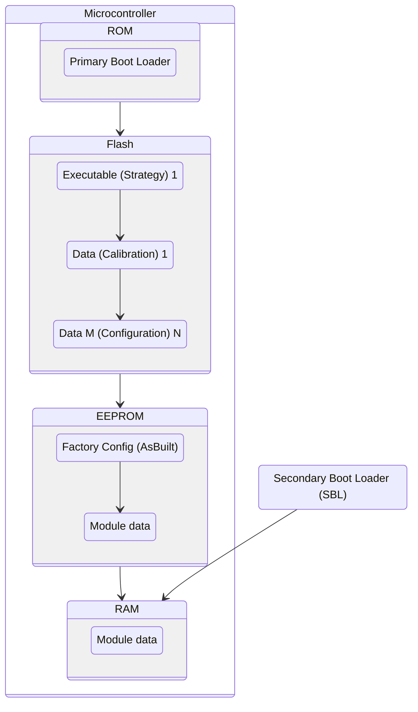

# Ford Electrical Module Overview

[You may want to start with the ford platform overview](/systems/ford_platform_overview.md).

Since the late 90s Ford vehicles have used a control module architecture that allowed individual modules to be serviced from the CAN bus instead of having dedicated module programming connections. This system, referred to as the `Ford Module Firmware Update` procedure, or FMFU, is what enables over-the-bus updating of module firmware.

Starting in the late 2000s Ford greatly expanded the number of modules built on the common electronic module structure and began packing the functionality into every cost-effective chunk of the vehicle they could. This also coincided with their strong push to make vehicle parts more interchangeable, and resulted in significant cross-compatibility for modules and different vehicles. This is part of what makes owning a C-Max exciting, there's lots of existing documentation and tooling on these modules!

This article will focus on [C1MCA and CGEA 1.2-1.3 era architectures](/systems/ford_platform_overview.md) as that's what matters for the C-Max.

## Hardware and Firmware Structure

This is a simplified diagram, actual memory structure layout can be all over the place. There can be multiple ROM segments between EEPROM segments, and ability to modfiy the ROM is only prevented by the FMFU process, it's not actually a separate memory segment.

The microcontroller (MCU) boots the Primary Boot Loader at the start of the memory block. This implements MCU startup, a fallback dealer recovery communication mode, and loads the application executable for actual module functionality.

Ford refers to the MCU application as a "Strategy" file, this is the application controlling the module in normal operation.

The application relies on configuration data, sometimes "Calibration" or "Configuration" in Ford's parlance.

Updating module firmware requires a module reboot, as normal application execution disables the FMFU bootloader functionality.

### Module Calibration Level

The combination of

* Physical part number
* Strategy part number
* Calibration part number

is calculated together into a _Calibration Level_, a dynamically generated value from the multiple inputs that determines what the correct combination of programmables on the module are.

FORScan handles most of this dynamically and employs Dark Magic to figure it all out. Further evidence the cost of their tool is worth it.

[See this document for more about module firmware updating](./ford_module_updating.md).

## Central and Distributed Configuration

A given module will have built-vehicle-specific configuration flags that must be set for the module to operate properly. These flags can come from multiple sources and are stored in different ways:

* Individual config: Flags stored directly on the module itself.
* Central config (CC): Flags stored in a central module (usually the [Body Control Module](./BdyCM.md)) and read by other modules over the network.

This configuration is generally referred to on the internet as `As-Built` or `AsBuilt`. In official documentation this actually refers to _a specific configuration_ that was programmed at the factory as part of vehicle manufacture.

C-Maxes distribute the system configuration between central and individual configuration on modules. This means some modules do not have any configuration options and won't show up in the editor in FORScan, instead those values are set in the Central Config.

[See this document for more about module config](./ford_module_config.md).

## Sources

* [FORScan thread on module firmware architecture](https://forscan.org/forum/viewtopic.php?f=13&t=18751)
* [FORScan thread on module configuration](https://forscan.org/forum/viewtopic.php?t=17208)
* [FORScan thread on central configuration](https://forscan.org/forum/viewtopic.php?f=16&t=1932)
* [MIT paper on CGEA](https://dspace.mit.edu/handle/1721.1/59222)
